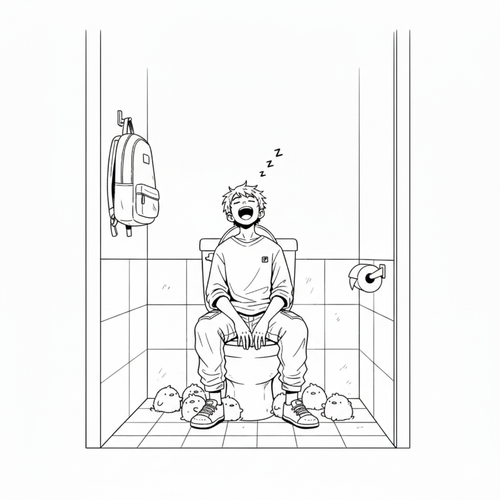

<!--  -->

<!--  -->

Gue nggak habis pikir sama orang yang kalau lewat depan kamar mandi masih nanya, "Ada orang di dalam?". Padahal keran air udah gue hidupin kenceng-kenceng. Kadang lantai sengaja gue siram-siram—padahal mah pura-pura doang—biar orang di luar tahu ada kehidupan di dalam. Tapi tetep aja ditanya. Gue yang di dalam kan jadi nggak khusyuk, bawaannya was-was!

Pernah juga lagi asik boker, pintu malah digedor-gedor. Gue teriakin aja, "Antri bos!". Eh, makin menjadi gedornya. Karena kesel, gue lempar aja pintunya pakai gayung. Pas keluar? Kepala gue yang digebuk pakai gayung. Ternyata Bapak gue. Fix, bos beneran.

## Setan Boker & Ritual Keberangkatan

Bagi gue, boker itu pengganggu nomor satu kalau mau berangkat kampus. Rasanya kayak ada yang ngikutin dari belakang. Pas udah rapi mau berangkat, tiba-tiba setan boker ngebisikin. "Udah boker belum?". Gue kegep.

Padahal persiapan gue udah matang. Handphone check, dompet check, helm check. Pas kaki udah mau starter motor, tiba-tiba ada panggilan alam. "Ya Allah, perasaan pas mandi tadi nggak ngerasa apa-apa deh," keluh gue. Akhirnya gue balik lagi, boker, dan harus ngulang ritual dari awal. Handphone check, dompet check, helm check. Capek, lho.

## Tragedi Kloset Duduk

Pernah juga kejadian pas boker di kloset duduk, kayaknya gue lupa kunci pintu. Atau emang semesta lagi pengen bercanda aja. Adek gue tiba-tiba nyelonong masuk. Gue bengong, dia kaget. Gue sempet lupa napas selama 3 detik. Si bangsat malah ketawa sambil nutup pintu!

Sisa waktu boker gue habiskan dengan _overthinking_. "Kok bisaaa?!". Pas keluar, gue diceng-cengin abis-abisan. Gue sumpahin pantatnya rapet biar nggak bisa boker sekalian!

## Boker _as an Inspiration Source_

Tapi ya, nggak selamanya boker itu jadi pengganggu. Menurut gue, kalau kita boker dengan khusyuk dan tenang, biasanya bakal dapet hidayah atau inspirasi brilian. Otak gue mendadak encer kalau lagi di sana. Makanya kalau lagi buntu ngerjain proyek coding, gue... boker. Biar dapet solusi. Tapi nggak sambil bawa laptop juga sih.

Gue bagi boker jadi dua jenis berdasarkan waktu:

1. Pagi hari. Berarti perut gue aman, metabolisme lancar.
2. Siang, sore, atau malam. Ini baru gawat. Gue langsung mikir keras, "Tadi gue makan apaan, ya?"

## Trauma di Toilet Umum

Satu hal yang paling gue hindari. boker di tempat umum, apalagi di SPBU. Selain (biasanya) bau, gantungannya sering nggak ada, kunci pintunya pun udah mau copot. Gue yang di dalam panik sesaat, pengen lanjut tapi was-was pintu jebol, kalau nggak lanjut takut cepirit. Akhirnya pasrah. Sejak saat itu, gue berikrar. Haram hukumnya boker di Pertamina lagi.

Udahan dulu ya ceritanya. Pegel. Mau cebok.

---

> "Tulisan ini dibuat 04 Agustus 2020." — Kang Boker
